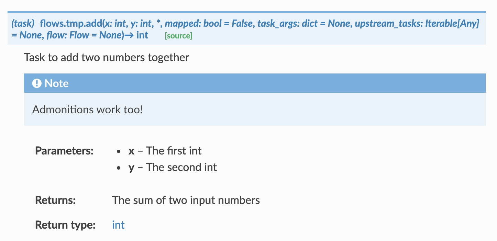

# sphinxcontrib-prefecttask

An extension to autodoc Prefect Tasks

## Installation

```
pip install sphinxcontrib-prefecttask
```

Once installed, edit your `docs/source/conf.py` file and add the extension to your current list of extensions:

```
extensions = [...
              'sphinxcontrib.prefecttask'
              ]
```

:warning: for the below to work, your code must be importable, so your `conf.py` file should probably have something like the following at the top


```python
sys.path.append(os.path.abspath("../../"))  # so we can import flows
```

## Usage

With the extension installed, `autodoc` will automatically find [task](https://docs.prefect.io/core/concepts/tasks.html) decorated objects (e.g. when using the automodule directive) and generate the correct documentation (as well as add a ``(task)`` prefix).

For example, assume you have the following directory structure and files

```
├── docs
│   └── source
│       └── conf.py
└── flows
    └── my_flow.py
```

you could generate the docs for the tasks found in `my_flow.py` with

```reStructuredText
.. automodule:: flows.my_flow
   :members:
```


You can also refer to the tasks using the syntax

```reStructuredText
:meth:`flows.my_flow.add`
```

where `add` is the name of a task in `my_flow`

FInally, you can also manually document a single task

```reStructuredText
.. autotask:: flows.my_flow.add
```

### Example

A visual for the rendered docs of the given flow are shown below.

```python
# flows/my_flow.py
from prefect import task, Flow

@task
def add(x: int, y:int) -> int:
  """Task to add two numbers together
  
  .. note::
  	Admonitions work too!
  
  Parameters
  ----------
  x
  	The first int
  y
  	The second int
  	
  Returns
  -------
  int
  	The sum of two input numbers
  """
    print("Hello world")

with Flow(name="foo") as flow:
    add(1,2)
```



